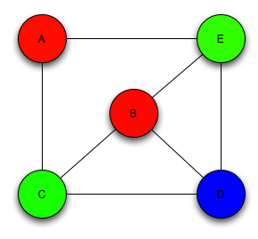

# Graph Coloring

This code is a project for the discipline Analysis and Project of Algorithms, in the Federal University of Paraiba, Brazil.

In this project, we aim to implement a heuristic to resolve the Graph Coloring problem.

## Introduction to the problem

In the Graph Coloring problem, we aim to color the verticies of a graph, in a way that two vertices of the same color are not adjacent to each other. Using the minimum number of colors possible.



You can see above a valid coloring for the graph.

## Algorithms implemented

* **Construction Heuristic** - Used to build a first coloring.
````
for each myvertex on the adjacent matrix
  mycolor = 0;
  while(there is a adjacent vertex colored with mycolor)
    mycolor++;
  myvertex.color = mycolor;
````
* **DSATUR** - Heuristic to the Graph Coloring problem, created by Daniel Brélaz in 1979
  1. Order the vertices in descending order of degrees.
  1. Color a vertex of maximum degree with color 1.
  1. Choose a vertex with maximum DSAT. In case of equality, choose a vertex of maximum degree.
  1. Color this top with the smallest possible color
  1. If all the vertices are colored then stop. Otherwise go in 3.

  ````
   DSAT (v) = number of different colors in vertices adjacent to v
  ````

* **VND** - Aims to eliminate colors from an early coloring, by trying to eliminate color *x*, changing all vertices colored with *x* to the other colors.
````
for each mycolor on the graph coloring
  for each myvertex colored with mycolor
    for each other proposedcolor on the graph coloring
      if(there is no adjacent vertex colored with proposedcolor && proposedcolor != mycolor && proposedcolor is in the graph)
        myvertex.color=proposedcolor;
        break;
    check which colors are on the graph
````


## Getting Started

These instructions will get you a copy of the project up and running on your local machine for development and testing purposes.

### Prerequisites

What things you need to install the software and how to install them

```
G++ or compatible installed.
```

### Installing

To run the code in LINUX, in the directoy file:

```
make
```

And next:

```
./build/graphcoloring
```

## Change input graph

There is a directory called inputs with a number of graphs to test, to change the graph that's going to be colored, in /source/graph.cpp , on Graph::Graph():

```
adjacent_matrix = ReadFile("inputs/input-name.col", &vertices_number);
```
With **input-name** being the name of the .col input to be tested.

